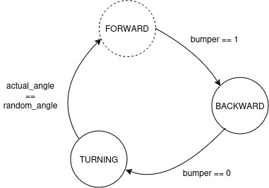

# P1 - Vacuum Cleaner
In this practice, I have implemented a simple algorithm for the navigation of the robot vacuum cleaner using the bumper and the laser sensors.

## Finite-State Machine
To start developing the algorithm, I defined a list of states and the inputs that trigger the transitions between each state.

Initially, the robot starts in the `FORWARD` state until the bumper detects a collision.

Then, it transitions to the `BACKWARD` state to separate from the wall and avoid any scratches.
When the bumper no longer detects a collision, the robot changes to the `TURN` state.

In the `TURN` state, the robot rotates until it achieves a random angle.

Finally, the robot resumes its cleaning in the `FORWARD` state.

## Implementation
To implement the algorithm, I defined two functions that process laser sensor data: one converts laser distance readings from degrees to radians, and the other calculates the actual angle. Additionally, a third function randomizes an angle.

Adding randomization enhances the algorithm's robustness, as this unpredictability allows the robot to cover more area effectively.

## Robot cleaning for 10 minutes

