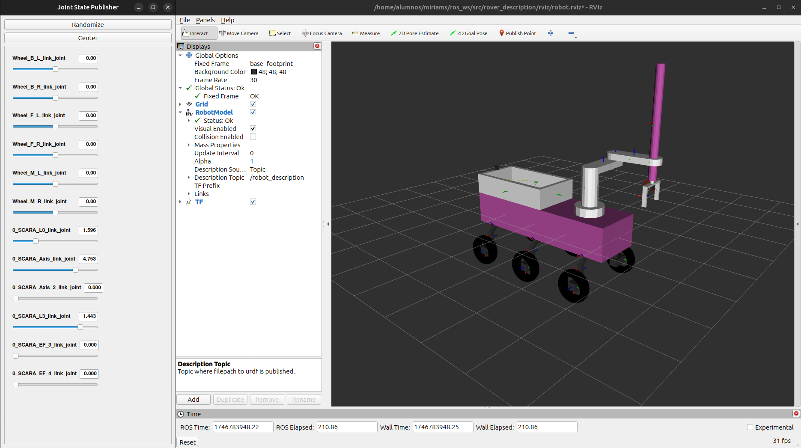

# P3 - Simulación en ROS y Gazebo
    
## TIEMPO VS G-PARCIAL

Durante el intervalo sombreado, se identifica una secuencia de movimientos de pick and place.

0_SCARA_L3_link_joint, es el joint encargado de poder alcanzar el cubo. Podemos ver como se mantiene constante el valor de esfuerzo hasta que el brazo hace contacto con el cubo, en ese momento el valor de effort cae en picado. 

A continuación, se recoge el cubo, podemos observar como los joints de los dedos de la pinza (0_SCARA_EF_3_link_joint y 0_SCARA_EF_4_link_joint) suben su effort.

Una vez que el cubo está agarrado, el brazo comienza a subir de nuevo por lo que el valor de 0_SCARA_L3_link_joint vuelve a estabilizarse.

Finalmente, se mueven el resto de joints para llevar el cubo al almacén del robot, aunque este paso no puede completarse depositando el cubo ya que el cubo colisiona contra el propio almacén (imagen adjunta en el apartado GALERÍA del blog)

## TIEMPO VS POSICIÓN DE LAS RUEDAS

Esta gráfica muestra la evolución de la posición de las ruedas del rover, lo que permite analizar cómo se ha desplazado para asistir al brazo robótico.

Al inicio, podemos observar un aumento rápido y simultáneo de todas las ruedas, indica que el rover comienza a moverse con trayectoria recta.

A la mitad, hay variaciones desiguales entre las ruedas delanteras y traseras, lo que reflejan las maniobras de reposicionamiento para recoger el cubo correctamente.

Al final, las ruedas se mantienen constantes, esto se debe a que el rover se mantiene estacionario mientras se ejecuta el pick and place.

## ACCESO A ROSBAG
Enlace a rosbag en GitHub:

📦 [rosbag](https://github.com/msandia2022/msandia2022.github.io/tree/main/recursos/rosbag2_2025_05_10-20_23_55)

## VÍDEO EJECUCIÓN
<video width="600" controls>
  <source src="recursos/Ejecución_rover.mp4" type="video/mp4">
  Your browser does not support the video tag.
</video>

## GALERÍA

