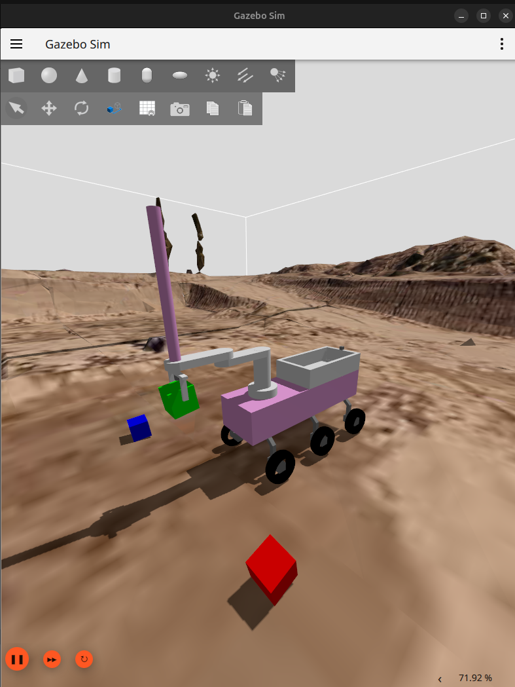

# P3 - Simulación en ROS y Gazebo
    
## TIEMPO VS G-PARCIAL
Explicación detallada de las gráficas generadas, describiendo el comportamiento del robot en momentos específicos durante la teleoperación.

## TIEMPO VS POSICIÓN DE LAS RUEDAS
Explicación detallada de las gráficas generadas, describiendo el comportamiento del robot en momentos específicos durante la teleoperación.

## ACCESO A ROSBAG
Enlace a rosbag en GitHub:

📦 [rosbag](https://github.com/msandia2022/msandia2022.github.io/tree/main/recursos/rosbag2_2025_05_10-20_23_55)

## VÍDEO EJECUCIÓN
<video width="600" controls>
  <source src="recursos/Ejecución_rover.mp4" type="video/mp4">
  Your browser does not support the video tag.
</video>

## GALERÍA

