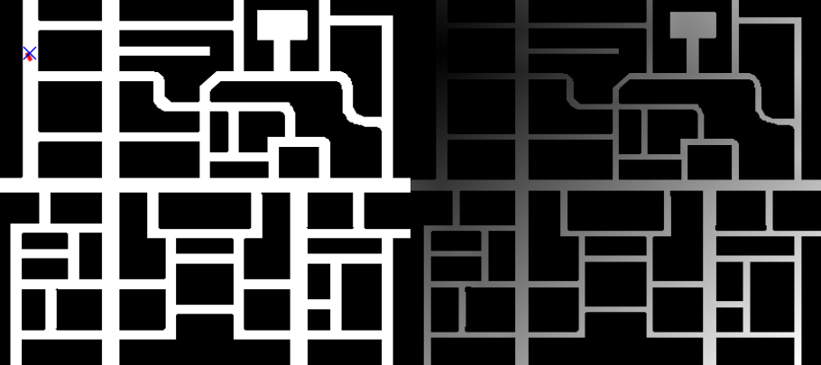
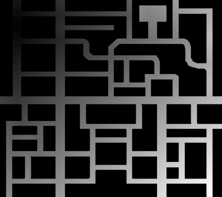
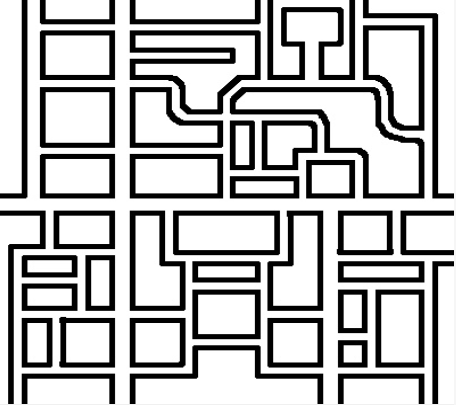

# P4 - Global Navigation using TeleTaxi
In this practice, I implemented an algorithm for a self-driving car to navigate towards a destination selected on the map while driving through the city using **Gradient Path Planning**. The **Wave Front Algorithm** builds a **cost map** and an **obstacle map**, which together define the gradient used for navigation.

## Implementation
### Cost map
The **cost map** represents the propagation of costs starting from the destination. The cost at each cell is calculated based on the distance from the destination. It is initialized with infinite values and updated iteratively to propagate costs.

### Obstacle map
The **obstacle map** accounts for obstacles and applies penalties to nearby cells, creating a buffer zone around them. Obstacles are marked as zero, and a radius of penalized cells is defined to prevent the car from navigating too close to them.

### Navigation with Gradient Path Planning (GPP)
The navigation process includes three key steps:
1. **Cost Propagation**: The destination cell is assigned a cost of 1 to distinguish it clearly from obstacles, and costs propagate outward using a breadth-first search (BFS) approach.
2. **Obstacle Penalty**: Obstacles and nearby cells are penalized to prevent collisions.
3. **Gradient Navigation**: The car moves towards cells with the lowest gradient values, recalculating dynamically.

## Demonstration
<video width="600" controls>
  <source src="recursos/video-P4.mp4" type="video/mp4">
  Your browser does not support the video tag.
</video>

<style>
  body {
    background-color: #121212; /* Fondo oscuro */
    color: #E0E0E0; /* Texto claro */
  }

  h1, h2, h3 {
    color: #BB86FC; /* Púrpura para encabezados */
  }

  a {
    color: #03DAC6; /* Verde azulado para enlaces */
  }

  video {
    border: 2px solid #BB86FC; /* Borde púrpura alrededor del video */
  }
