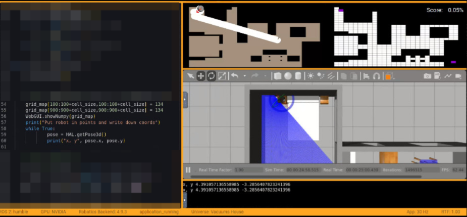
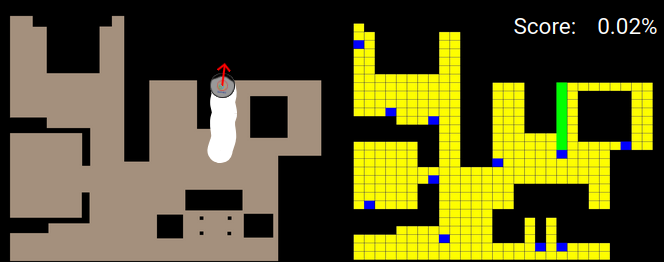
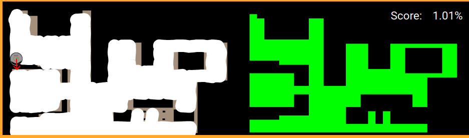

# P1 - Localized Vacuum Cleaner

## Introducción

En este proyecto he desarrollado un sistema de navegación autónoma para un robot aspirador, combinando planificación de rutas y control de movimiento. A lo largo del proceso, he diseñado una representación del mapa basada en celdas, implementado algoritmos de barrido y búsqueda, y afinado la lógica de control del robot para lograr una limpieza eficiente y libre de colisiones.

## 1. Análisis el mapa

El punto de partida fue entender cómo representar el entorno de forma que el robot pudiera interpretarlo y desplazarse dentro de él. La primera decisión fue convertir el mapa proporcionado en un **grid map** donde cada celda representa una porción del entorno real.  
De esta forma, el robot puede razonar en términos discretos: “celda libre”, “celda ocupada”, “celda visitada”, etc.  

Definí el tamaño de las celdas en **32 píxeles**, un tamaño ligeramente más pequeño que las dimensiones del robot para evitar dejar trazos sin barrer. Luego, generé dos estructuras principales:  
- `grid_cells`: todas las celdas del mapa.  
- `obstacle_cells`: aquellas que contienen píxeles negros (obstáculos).  

El resultado fue un mapa cuadriculado donde el robot puede distinguir claramente las zonas transitables de las bloqueadas.

## 2. Detección de obstáculos

Una de las primeras dificultades fue que los bordes de los obstáculos no siempre estaban bien definidos por lo que hacían que el robot intentara pasar demasiado cerca de ellos.
La solución fue aplicar una **operación de erosión con OpenCV**, lo que “engorda” visualmente los obstáculos y aumenta la distancia de seguridad. Esta simple mejora redujo mucho los atascos y colisiones.

## 3. Transformación de coordenadas del mundo a coordenadas del mapa

Otro paso clave fue implementar la **transformación entre coordenadas del mundo real y coordenadas del mapa**.  
El origen en el simulador se encuentra en unas coordenadas distintas que el origen del mapa. 
Mediante una regresión lineal (`np.polyfit`) con varios puntos de referencia, obtuve una relación matemática que me permite pasar de un sistema al otro.  
Esto es esencial para que el robot “sepa” en qué celda se encuentra en todo momento, basándose en sus coordenadas reales (`HAL.getPose3d()`).

Para ello desplacé el robot por el simulador a 4 puntos conocidos en el mapa y apunté sus coordenadas.

## 4. Diseño del algoritmo de barrido BSA

Una vez el entorno estaba definido, necesitaba un algoritmo que **permitiera recorrer todas las celdas libres sin dejar zonas sin limpiar**.
Implementé el **Backtracking Spiral Algorithm** que sigue un patrón en espiral, yendo en dirección norte siempre que sea posible, si no continuara por el Este, Sur u Oeste.
Esto permitió cubrir prácticamente toda el área accesible.

También añadí un **sistema de detección de celdas de retorno**, marcadas en azul, para evitar colisiones en trayectorias entre celdas no adyacentes. Si el robot encontraba una de estas celdas, recalculaba una ruta corta con un BFS (Breadth-First Search), garantizando que pudiera volver a zonas accesibles.

## 5. Control de movimiento y orientación

Para que el robot recorra el plan generado por el BSA es necesario gestionar la velocidad lineal y angular de forma coherente con su orientación actual.  
Implementé un sistema de control que calcula el **error angular** hacia el centro de la celda objetivo y ajusta las velocidades (`setV` y `setW`) en función de ese error.

El resultado fue un desplazamiento más suave y realista.  
También añadí una rutina de **detección de obstáculos móviles**, aprovechando los datos del **sensor de bumper**, que permite reaccionar dinámicamente si el robot choca o detecta algo inesperado en su camino.

## 6. Visualización y depuración

Durante las pruebas, la **visualización con `WebGUI.showNumpy()`** fue fundamental.  
Pude observar en tiempo real el mapa, las celdas libres, los obstáculos, la ruta planificada (amarillo) y las zonas ya limpiadas (verde).  
Esto me permitió detectar errores de indexado, ajustes en las transformaciones y pequeños fallos de precisión en la localización.

## 7. Resultados

Tras varias iteraciones, pruebas y correcciones, el sistema logró realizar un **recorrido completo y ordenado del entorno**, marcando las zonas limpias y evitando obstáculos fijos sin necesidad de sensores de contacto.

## 8. Conclusiones

Este proyecto me permitió poner en práctica muchos conceptos de **robótica móvil**, desde la representación del entorno hasta el control cinemático y los algoritmos de búsqueda.  
Más allá del código, lo más interesante fue la parte de **iteración y ajuste continuo**, probando, fallando y corrigiendo hasta conseguir un comportamiento fluido y funcional.  

## 9. Video demostrativo

En este vídeo podemos ver al robot aspirador en acción recorriendo toda la superficie. El ciclo completo de limpieza dura unos 16 minutos, pero aquí se muestra acelerado a velocidad ×16 para observar de forma más dinámica su comportamiento.

<video width="600" controls>
  <source src="recursos/limpieza_x16.mp4" type="video/mp4">
  Your browser does not support the video tag.
</video>

