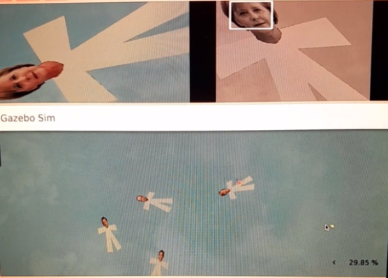

# P2 - Rescue People

## Introducción

En este proyecto he desarrollado un **sistema de rescate de víctimas con un dron**. Estas son detectadas mediante la cámara ventral utilizando un detector facial, y se almacenan sus posiciones para su posterior rescate. El dron recorre una zona de búsqueda definida previamente, vuelve a la base cuando detecta batería baja y es capaz de reanudar la misión tras recargar.
 
## 1. Aproximación a la zona

Lo primero que tuve que resolver fue cómo hacer que el dron llegara hasta la **zona de rescate**.
Conocía las posiciones GPS tanto del barco (donde parte el dron) como del punto aproximado donde se perdió la señal del avión. Sin embargo, el dron trabaja en su propio sistema de coordenadas locales, así que necesitaba traducir esa información.

Transformé las coordenadas GPS a **UTM** y, una vez en ese formato, calculé la diferencia entre la posición del barco y la del área de rescate.
Como el dron toma su posición inicial como el origen (0, 0), esa diferencia me dio directamente las **coordenadas de destino en su propio sistema de referencia**.
A partir de ahí, solo quedaba enviarle la orden de vuelo hacia ese punto para iniciar la misión.

## 2. Algoritmo de barrido

Una vez en la zona, diseñé un **patrón de barrido en zigzag** para asegurar que el dron revisara toda el área sin dejar huecos.
Definí los límites de la región y generé automáticamente los **waypoints** que el dron debía seguir.
El resultado es un movimiento ordenado y sistemático, donde el dron va recorriendo franjas laterales a una altura fija hasta cubrir toda la superficie.

## 3. Detección de caras

Para identificar a las posibles víctimas utilicé un **clasificador Haar Cascade** de OpenCV.
Durante las primeras pruebas noté que la detección fallaba cuando la cara aparecía inclinada o en una posición poco habitual.
Para solucionar esto añadí una pequeña mejora: si no se detecta ninguna cara, el dron **rota la imagen en varios ángulos (45°, 90°, 135°...)** hasta que consigue una detección fiable.

Gracias a esto, el sistema se volvió mucho más robusto ante diferentes orientaciones.

## 4. Gestión de la batería

Quería que el dron tuviera un comportamiento autónomo también en cuanto a su “energía”.
Implementé un **contador de tiempo de vuelo** que simula la duración de la batería.
Cuando supera los 10 minutos, el dron interrumpe la búsqueda y **vuelve automáticamente a la base** para aterrizar y “recargar”.
Después de unos instantes, despega de nuevo y **reanuda la búsqueda justo donde la dejó**, completando el ciclo de forma autónoma.

<video width="600" controls>
  <source src="recursos/carga_bateria_480.mp4" type="video/mp4">
  Your browser does not support the video tag.
</video>

## 5. Visualización y depuración

La fase de depuración fue muy visual. Gracias a `WebGUI.showImage()` pude observar en tiempo real lo que la cámara del dron veía y cómo se producían las detecciones.
Esta herramienta me permitió detectar que algunas caras solo se reconocían al rotar ligeramente la imagen, lo que confirmó la necesidad de la mejora mencionada antes.
También utilicé `WebGUI.showLeftImage()` para mantener una vista continua de la cámara ventral durante todo el vuelo.

## 6. Resultados y conclusiones

El dron logró **completar la búsqueda de víctimas con éxito**, detectando y registrando correctamente sus posiciones.
El sistema logra mantener un comportamiento coherente incluso tras varios ciclos de carga y descarga simulada.

Ha sido un proyecto muy completo donde he podido aplicar conceptos de **visión por computador, planificación de trayectorias y control de estados**.
Además, me ha ayudado a afinar detalles prácticos como el manejo de coordenadas.

## 7. Video demostrativo

En este vídeo se puede observar el funcionamiento completo del dron durante la misión de rescate:

<video width="600" controls>
  <source src="recursos/rescate_480.mp4" type="video/mp4">
  Your browser does not support the video tag.
</video>

