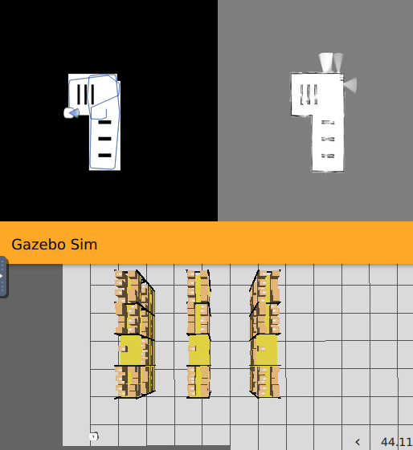

# P5 – Laser Mapping

## Introducción

En este proyecto he desarrollado un sistema de **navegación autónoma basado únicamente en sensores láser**, capaz de desplazarse por un entorno desconocido mientras construye en tiempo real un mapa de ocupación. El robot utiliza un comportamiento reactivo para evitar obstáculos y, al mismo tiempo, genera un mapa bidimensional marcando zonas libres y obstáculos detectados mediante el láser. El sistema combina una navegación sencilla pero robusta con un proceso continuo de actualización del mapa, lo que permite que el robot avance por el entorno sin necesidad de planificación global.

El funcionamiento del robot se apoya en dos módulos principales:  
- Un **mapeador láser**, que interpreta cada rayo, proyecta su trayectoria sobre el mapa e identifica tanto espacios transitables como puntos de impacto.  
- Un **controlador reactivo**, que analiza sectores del láser y decide cómo avanzar, detenerse o girar según la proximidad de los obstáculos.

Gracias a esta combinación, el robot mantiene un desplazamiento estable y es capaz de construir una representación coherente del entorno en tiempo real.

---

## 1. Sistema de navegación reactiva

El robot realiza su navegación dividiendo la lectura del láser en tres sectores clave: frontal, lateral izquierdo y lateral derecho. A partir del valor mínimo en cada sector, decide la acción más segura.  
Cuando el espacio frontal está libre, avanza en línea recta. Si detecta un obstáculo por delante, gira hacia el lado con mayor distancia disponible. Cuando un objeto aparece cerca de la izquierda o la derecha, ejecuta una evasión lateral para evitar colisiones.

Este enfoque reactivo evita la necesidad de planificadores avanzados y resulta especialmente eficaz en entornos estrechos o cambiantes, ya que las decisiones se toman de forma inmediata en función de la percepción directa del sensor.

---

## 2. Construcción del mapa mediante láser

El sistema mantiene un mapa en escala de grises donde representa el entorno, actualizándolo en cada ciclo. Para cada rayo del láser se calcula el ángulo real según la orientación del robot y se recorre la trayectoria del haz hasta su distancia detectada o hasta un máximo permitido.

Durante este proceso aparecen dos zonas diferenciadas:

- **Zona libre**: se aclara progresivamente cada celda por la que pasa el rayo antes de impactar o llegar al rango máximo. Esto refuerza visualmente aquellas áreas confirmadas como transitables.  
- **Punto de impacto**: cuando el láser detecta un obstáculo válido, la celda correspondiente se oscurece. Esto permite que el mapa resalte claramente paredes u objetos.

La combinación de aclarado incremental y oscurecimiento genera un mapa denso, coherente y resistente a ruido, ofreciendo al usuario una representación clara del entorno que el robot va descubriendo.

---

## 3. Proyección del láser en el mapa

Cada lectura del sensor se transforma desde coordenadas reales del robot hasta coordenadas de mapa usando la función proporcionada por el entorno de simulación. El sistema se asegura de que cada punto marcado esté dentro de los límites del mapa, evitando errores y garantizando que todas las actualizaciones son válidas.

Este mecanismo permite una representación acumulativa: cuanto más se mueve el robot, más completa y contrastada se vuelve la imagen del entorno.

---

## 4. Actualización continua y visualización

El mapa comienza completamente gris, representando un entorno desconocido. A medida que el robot avanza, el sistema refresca la visualización frame a frame, permitiendo observar cómo se revelan zonas libres y cómo aparecen los obstáculos detectados.

La interfaz WebGUI muestra en tiempo real la evolución del mapeo, lo que facilita la interpretación del movimiento del robot y el progreso del escaneo láser.

---

## 5. Bucle principal del sistema

El proceso completo de navegación y mapeo se ejecuta de forma continua dentro de un bucle que combina:

- lectura del láser,  
- decisión de movimiento reactivo,  
- actualización del mapa,  
- y sincronización mediante el módulo de frecuencia.

Gracias a este flujo, el robot mantiene una ejecución estable, sin pausas perceptibles y con una respuesta inmediata ante cambios del entorno.

---

## 6. Resultados y conclusiones

El robot fue capaz de desplazarse de forma autónoma evitando obstáculos y generando un mapa en tiempo real de alta claridad. El sistema reactivo permitió que el robot navegara de manera simple pero eficaz, mientras que el mapeado con láser produjo una representación detallada del entorno con zonas libres bien definidas y obstáculos marcados de forma nítida.

Este enfoque demuestra que incluso sin planificación global ni algoritmos complejos, un robot es capaz de desenvolverse adecuadamente en entornos desconocidos mediante una combinación de percepción continua y reglas de navegación basadas en sectores.

---

## 7. Funcionamiento en vídeo

En este vídeo se puede observar el comportamiento del robot: avance en zonas despejadas, giros ante obstáculos, y la construcción progresiva del mapa mostrado en la interfaz.

<video width="600" controls>
  <source src="recursos/laser-mapping.mp4" type="video/mp4">
  Your browser does not support the video tag.
</video>

---

