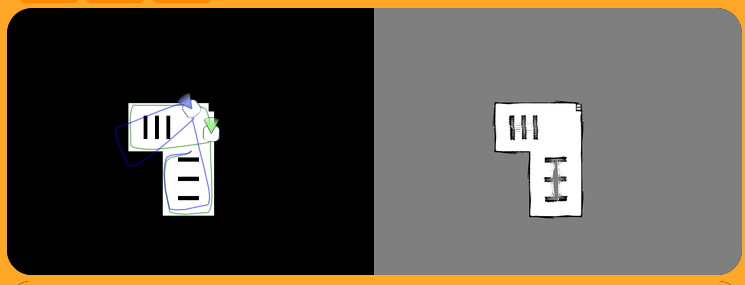
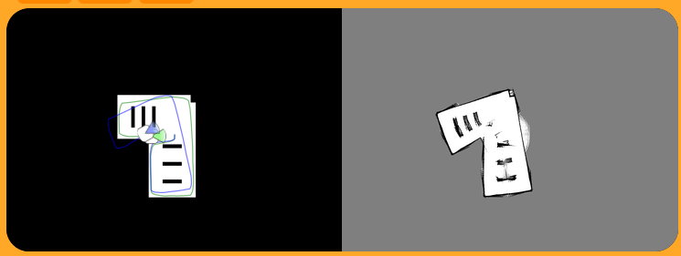
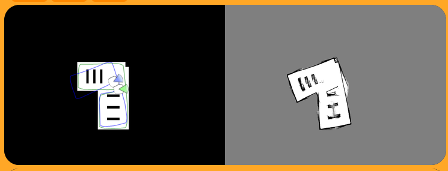
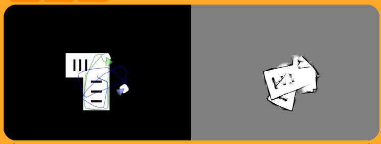

# P5 – Laser Mapping

## Introducción

En este proyecto he desarrollado un sistema de navegación autónoma basado únicamente en sensores láser, capaz de desplazarse por un entorno desconocido mientras construye en tiempo real un mapa de ocupación probabilístico. El robot utiliza un comportamiento reactivo para evitar obstáculos y, al mismo tiempo, genera un mapa bidimensional marcando zonas libres y obstáculos detectados mediante el procesamiento de rayos láser en formato Log-Odds. El sistema combina una navegación sencilla pero robusta con un proceso continuo de actualización del mapa, lo que permite que el robot avance por el entorno de manera eficiente sin necesidad de planificación global.

El funcionamiento del robot se apoya en dos módulos principales:  
- Un **mapeador láser**, que interpreta cada rayo, proyecta su trayectoria sobre el mapa mediante un tamaño de paso optimizado e identifica tanto espacios transitables como puntos de impacto acumulando evidencia matemática.
- Un **controlador reactivo**, que analiza sectores clave del láser y decide cómo avanzar, detenerse o girar según la proximidad de los obstáculos.

---

## 1. Sistema de navegación reactiva

El robot realiza su navegación dividiendo la lectura del láser en tres sectores clave: frontal, lateral izquierdo y lateral derecho. A partir del valor mínimo en cada sector, decide la acción más segura.  
Cuando el espacio frontal está libre, avanza en línea recta. Si detecta un obstáculo por delante, gira hacia el lado con mayor distancia disponible. Cuando un objeto aparece cerca de la izquierda o la derecha, ejecuta una evasión lateral para evitar colisiones.

Este enfoque reactivo evita la necesidad de planificadores avanzados y resulta especialmente eficaz en entornos estrechos o cambiantes, ya que las decisiones se toman de forma inmediata en función de la percepción directa del sensor.

---

## 2. Construcción del mapa mediante Log-Odds

Para lograr un mapa denso y resistente al ruido, el sistema incorpora el modelo probabilístico sensorial y la combinación de evidencias siguiendo la regla de Bayes. En lugar de utilizar valores binarios fijos o realizar costosas multiplicaciones de probabilidades condicionales tradicionales, la actualización se realiza de forma elegante mediante una representación en Log-Odds. Esta formulación matemática simplifica la regla de Bayes convirtiendo los productos probabilísticos en sumas y restas algebraicas directas sobre la rejilla.

Cada rayo del láser se transforma según la orientación del robot y se recorre su trayectoria. El mapa comienza en un gris neutro absoluto (0.0 en Log-Odds, que equivale a una probabilidad inicial de ocupación del 50% o zona desconocida) y combina las nuevas evidencias de forma incremental en cada ciclo:

- **Zona libre (Evidencia Bayesiana Negativa)**: se resta el valor `L_PROB_FREE = -0.3` a cada celda por la que transita el haz, aclarando progresivamente el suelo al disminuir su probabilidad de estar ocupada.
- **Punto de impacto (Evidencia Bayesiana Positiva)**: cuando el láser detecta un obstáculo válido, se suma `L_PROB_OCC = 2.5` a la celda final, aumentando drásticamente la confianza de ocupación y oscureciéndola con fuerza.

Para evitar la sobreconfianza y la inercia excesiva, se aplica un mecanismo de saturación restrictiva (`L_MIN_SATURATE = -5.0` y `L_MAX_SATURATE = 5.0`). Además, para garantizar la independencia de las medidas, el mapa solo se actualiza si el robot ha realizado un movimiento mínimo respecto a su última posición válida.

---

## 3. Binarización y visualización en tiempo real

Al final de cada ciclo, la matriz matemática de Log-Odds se mapea a una imagen visual en escala de grises (**0**-**255**). Se han establecido umbrales estrictos de certeza para evitar fluctuaciones:

- Si **Log-Odds > 0.8** se binariza a Negro (0), generando muros gruesos y definidos.
- Si **Log-Odds < -0.8** se binariza a Blanco (255), asegurando un pasillo limpio.

La interfaz WebGUI muestra frame a frame esta evolución, lo que permite observar visualmente cómo se descubren los pasillos.

---

## 4. Resultados y conclusiones

El robot fue capaz de desplazarse de forma autónoma evitando obstáculos y generando un mapa en tiempo real.
Cabe destacar que debido a la naturaleza puramente reactiva y aleatoria del algoritmo implementado no garantiza una cobertura óptima ni completa de la nave lo que dificulta la elaboración del mapa.

---

## 5. Funcionamiento

### Galería de mapas obtenidos

| Nivel de Odometría | Visualización del Mapa Generado |
| :--- | :--- |
| **Odometría Perfecta** _HAL.getPose3d_ |  |
| **Ruido Bajo** _Low Noise_ |  |
| **Ruido Medio** _Medium Noise_ |  |
| **Ruido Alto** _High Noise_ |  |

### Escenario A: Simulación con Odometría Perfecta

<video width="600" controls>
  <source src="recursos/halgetpose-git.mp4" type="video/mp4">
  Your browser does not support the video tag.
</video>

### Escenario B: Simulación con Ruido Bajo

<video width="600" controls>
  <source src="recursos/smallnoise-git.mp4" type="video/mp4">
  Your browser does not support the video tag.
</video>

---

